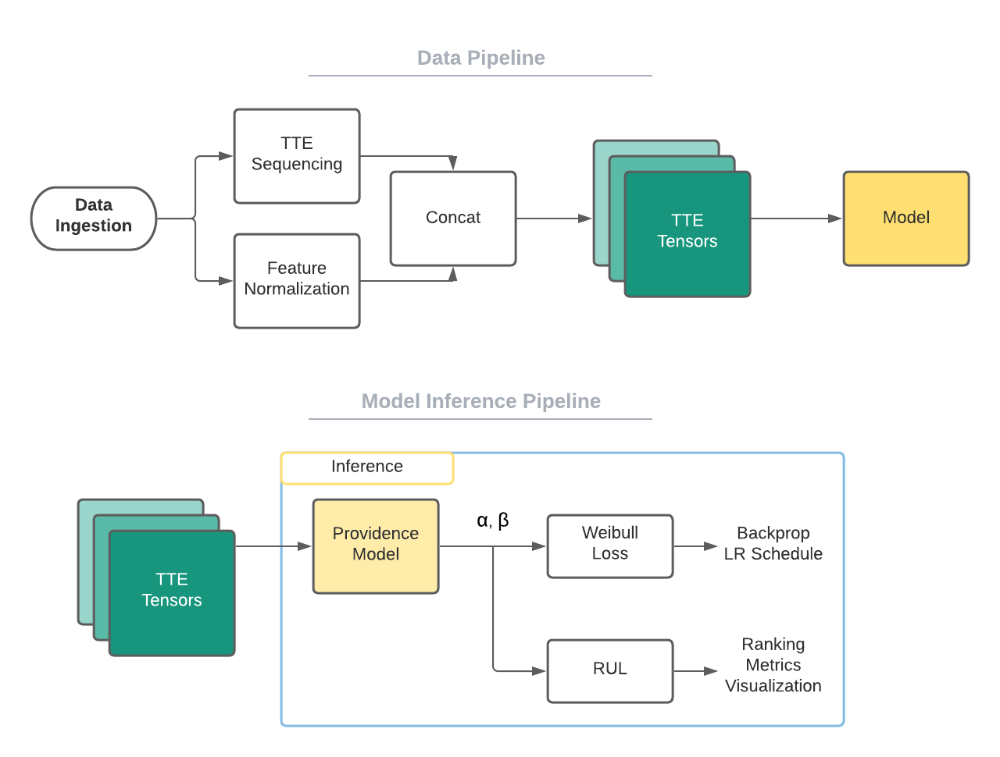

# Providence: A library for Neural Time-to-Event Prediction

## Background

### Prognostics and Health Management (PHM)

Prognostic Health Monitoring (PHM) and Condition Based Maintenance (CBM) are fields with robust bodies of research which have been transformed in recent years since the advent of deep learning.
The catalyst for a recent surge in time to event research can be attributed to concurrent advances in sensor and storage technology and the maturation of deep learning techniques. Consequently, deep learning for time-to-event modeling has gained in both popularity and effectiveness. Rich, multivariate time series data recorded from sensors have become a cornerstone of failure prognostics. Within the space of predictive maintenance in aerospace, the problem can be framed in many ways: from traditional regression or ranking methods to sliding-box classification to time series forecasting. These traditional methods struggle to capture the complex nature of the underlying complex dynamical system, the relationships between sensor signals, the degradation of the system over time, multiple failure modes, and the often very rare event of failure. Recurrent Neural Networks (RNNs) have been used widely in remaining useful life (RUL) research, effectively capturing the temporal nature of the problem and complex relationships between sensor signals. Capturing the degradation of a complex system requires a domain-specific solution, as provided in the Weibull Time-to-Event RNN (WTTE-RNN).

### So, what is Providence?
Providence is a neural [sequence-to-sequence][] framework for learning to predict a Weibull distribution across time
on arbitrary device datasets, with unit-time intervals. This work was heavily inspired by WTTE-RNN.

- to predict a weibull distribution, we regress two key distribution parameters that shape the simplified Weibull distribution
  - You would know these parameters by (α, β), (β, η), (α, ω) pairs. Herein we use the former.
- By "arbitrary device dataset" we mean that Providence handles a device-oriented time series data
  - This may be a single device in multiple experiments or 
- By unit-time intervals, we simply mean that "rows" have a common unit of reporting.
  - This means that the semantics of a given row should be consistent. If engineering takes daily snapshots of system health,
    each row of your data should correspond to a single data.
  - This does not preclude temporal "gaps" in the data
    - For example: if Providence were applied to a prediction of part degradation, your unit of time might be hourly captures.
      However, when the system reboots fortnightly, there is an offline period of 6 hours. This is perfectly fine.

Below is an overview of the Providence Framework



Providence is not yet well tested against signal / Hz-reported data.
There is nothing (in theory) holding it back from doing so, but we have yet to test it thoroughly.

## Installation

To install providence as a dependency

```
pip install rtx-providence
```

To leverage the repository locally:

```
git clone github.com/<RTX Github Org>/rtx-providence
```
or with SSH
```
git clone git@github.com:<RTX Github Org>/rtx-providence
```

## Running Providence
To train a model and see the expected outputs

```
python train.py
```

If you would like to change a few hyperparameters

```
python train.py --num-epochs=2000 --learning-rate=1e-5
```
- Other parameters can be leveraged. Look at the body of [`train.py`](./train.py) for more

<br>

To inspect the model outputs

```
python evalution.py --model outputs/Providence<ModelName>.pt
```


## Contributors

Principal contributors are Stephen Fox, Wim Verleyen, Tynan Daly, and Elizabeth "Liz" Zimmerman, all at `first.last@rtx.com`.

[sequence-to-sequence]: https://papers.nips.cc/paper/2014/file/a14ac55a4f27472c5d894ec1c3c743d2-Paper.pdf